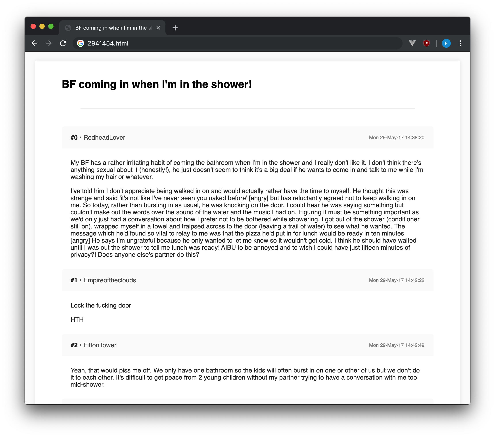

# mn-scraper
Scrapes MumsNet threads into JSON/simplified HTML formats, shamelessly taken from https://github.com/frannyfx/mn-scraper.

## How to install
- Clone the repository using Git
- [Install Node.js](https://nodejs.org/en/download/current/)
- Open a terminal and `cd` into the directory of the cloned repository
- Run `npm install`

## How to use

### Helper mode
To run the helper application:
- Execute `./bin/search`.
- Command line options can be listed by running `./bin/search -h`.

### Advanced mode
To run the underlying application:
- Execute `node main`.
- Here are the command line options:
	- `-e <email>` Email address [required or use session token]
	- `-p <password>` Password [required or use session token]
	- `-t <token>` Session token [required or use email and password]
	- `-q <query>` The search query [required]
	- `-f <format>` The output format [optional] `(html|json)`
	- `-o <dir>` The output directory [optional] - default is `/output` in the project folder
	- `-n <num>` Limit the number of threads that get scraped [optional]
	- `-c` Include the number of comments in a thread in the filename [optional]
	- `-a` Search for a specific topic (or multiple topics)
	- `--from` Search from a specified date in DD/MM/YY format.
	- `--to` Search to a specified date in DD/MM/YY format (used in addition to the `--from`).

#### Example usage
Login using an email and password combination (foo@example.com, bar), and scrape all threads containing "hello":

`node main -e foo@example.com -p bar -q hello`

Login using an email and password combination (foo@example.com, bar), and scrape at most 15 threads containing "hello":

`node main -e foo@example.com -p bar -q hello -n 15`

Login using an email and password combination (foo@example.com, bar), and save the threads in JSON format:

`node main -e foo@example.com -p bar -q hello -f json`

Login using an email and password combination (foo@example.com, bar), and search for "hello" in the topic "Adoption" (topic ID is 2418):

`node main -e foo@example.com -p bar -q hello -a 2418`

Login using an email and password combination (foo@example.com, bar), and search for "hello" in the topic "Adoption" and "Arts and crafts: (topic IDs are 2418 and 2280):
`node main -e foo@example.com -p bar -q hello -a 2418 -a 2280`

Login using a session token and scrape all threads containing "hello":

`node main -t A5FEBB0480999CC2482F5DDE13371337-n1 -q hello`
